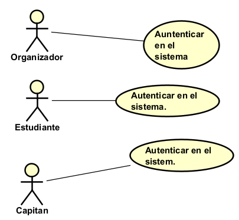
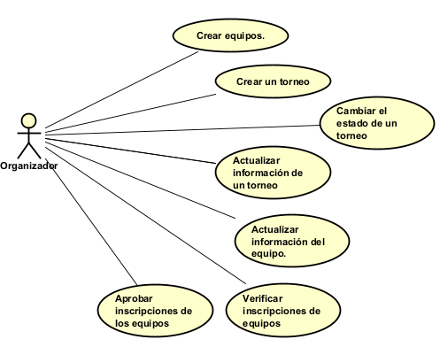
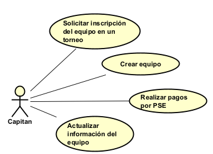

# 📄 Requerimientos del Sistema

## 1. Lista general de requerimientos

El sistema de TechCup tiene los siguientes requerimientos:

### 1.1 Requerimientos funcionales

El sistema de TechCup debe tener la capacidad de:

1. Permitir la autenticacion de los diferentes tipos de usuarios (Organizadores, Capitanes, y Estudiantes) mediante nombre de usuario y contraseña.

2. Permitir a los organizadores crear torneos (identificacion, fecha, cuotas, organizador, partidos), cambiar su estado, actualizar su informacion, e inscribir equipos a un torneo activo.

3. Permitir a los organizadores consultar y validar los pagos de los equipos, y aprobar las inscripciones de los equipos.

3. Permitir a los organizadores generar un reporte de los equipos inscritos en los torneos que crearon y gestionan.

4. Permitir a los organizadores generar un reporte de los ingresos obtenidos por las cuotas de inscripcion de los torneos que crearon y gestionan.

5. Permitir a los capitanes crear equipos, realizar pagos por PSE, actualizar la informacion de los equipos, y solicitar la inscripcion de su equipo en el unico torneo activo.

6. Permitir a los Estudiantes cosultar el informe de equipos o torneos especificos.

7. No debe de permitir que existan dos torneos con la misma fecha y que tenga un estado de "Activo" o "En curso".

### 1.2 Requerimientos no funcionales

El sistema de TechCup debe tener:

1. Una interfaz cuya paleta de colores se compone de los colores: #A60F18, #000000, #FFFFFF.

2. Mostrar un mensaje al cliente cuando el usuario o contraseña ingresada sean incorrectos o los datos sean correctos y se haya logrado iniciar sesion o registrarse correctamente.

3. Tener una interfaz diferente en la pagina de inicio segun el tipo de usuario (Organizador, Capitan o Estudiante), para que cada uno tenga acceso a las funcionalidades correspondientes.

4. Una interfaz responsiva a las dimensiones del dispositivo en la que es presentada.

5. Para cada accion funcional de cada rol, se debe de indicar si fue exitosa o no, y en caso de no ser exitosa, indicar la razon.

## 2. Diagramas de caso de uso

### 2.1 Requerimiento Funcional 01

| Campo | Descripción |
|------|-------------|
| **ID** | RF-01 |
| **Nombre del requerimiento** | Autenticacion de Usuario |
| **Descripción** | *El sistema debe de permitir la autenticacion de los diferentes tipos de usuarios (Organizadores, Capitanes, y Estudiantes) mediante nombre de usuario y contraseña.* |
| **Precondiciones** | *Para que el sistema cumpla con este requerimiento, Bankify debe tener previamente al usuario registrado o permitir que se registre por primera vez, y validar que sea un estudiante de la Escuela con su correo institucional.* |
| **Actor** | *Organizadores, Capitanes y Estudiantes* |
| **Flujo principal** | *Registro* 1. Los 3 actores mencionados se registran con un usuario y contraseña en la interfaz de registro. 2. El sistema verifica las credenciales ingresadas, muestra un mensaje que indica si esas son correctas o incorrectas. 3. Y si son correctas; segun su tipo de correo institucional registra al nuevo usuario como Organizador o debe de seleccionar si es un Capitan o Estudiante. 4. El sistema envia al actor a la interfaz de inicio.  *Logeo* 1. Los 3 actores mencionados se logean con un usuario y contraseña en la interfaz de login. 2. El sistema verifica las credenciales ingresadas y muestra un mensaje que indica si estas son correctas o incorrectas. 3. Y si son correctas; inicia la sesion del usuario. 4. El sistema envia al actor a la interfaz de inicio.|
| **Diagrama de caso de uso** |  |
| **Poscondiciones** | *Se espera como resultado que se pueda registrar o logear un usuario que tenga un correo institucional, y acceder correctamente a la pagina de inicio en caso de que sus credenciales sean correctas.* |

### 2.2 Requerimiento Funcional 02

| Campo | Descripción |
|------|-------------|
| **ID** | RF-02 |
| **Nombre del requerimiento** | Funcionalidades Del Organizador |
| **Descripción** | *El sistema debe de permitir a los Organizadores crear torneos ingresando una fecha y una cuota de inscripcion, inscribir equipos a un torneo activo creado por el, actualizar la informacion del torneo activo, cambiar su estado (Pendiente, Activo, En curso, Cerrado y Cancelado), añadir partidos al torneo activo, consultar los equipos de un Torneo, consultar y validar los pagos de los equipos, aprobar las inscripciones de los equipos a su torneo, generar un reporte de los equipos inscritos a los torneos y generar un reporte de los ingresos obtenidos por las cuotas de inscripcion de los torneos, no debe de permitir que el organizador cree mas de un torneo por semestre o cree un torneo si ya hay uno activo en ese semestre, y tambien no debe de permitir eliminar torneos.* |
| **Precondiciones** | *Para que el sistema cumpla con este requerimiento, TechCup debe de tener previamente registrado al organizador como un usuario, los equipos que el organizador desea inscribir a su torneo ya deben de estar creados, para validar, consultar o aprobar las solicitudes o pagos de los equipos, ya deberian de existir algunas solicitudes y algunos pagos.* |
| **Actor** | *Organizador* |
| **Flujo principal** |*Crear Un Torneo* 1. El Organizador desde su interfaz de inicio acciona la funcionalidad de crear un torneo. 2. El sistema abre una nueva interfaz donde le solicita al organizador datos como la fecha y la cuota de inscripcion. 3.1 El Organizador una vez termina hace clic en el boton inferior de Crear. 3.2 El Organizador si desea puede cancelar la creacion de un torneo, haciendo clic en el boton inferior de Cancelar. 4.1 El sistema verifica que la fecha y la cuota ingresadas cumpla con las restricciones del sistema. 4.2 El sistema dirige al Organizador a la interfaz de inicio [Aqui Finaliza este Flujo] 5. El sistema crea el torneo. 6. El sistema dirige al Organizador a la interfaz de gestion del torneo creado.  *Inscribir Equipos Al Torneo Activo* 1. El Organizador dentro de la interfaz de gestion del torneo activo, acciona la funcionalidad de inscribir equipos. 2. El sistema abre una nueva interfaz donde el Organizador puede buscar los equipos por su nombre. 3. El Organizador ingresa parcialmente o la totalidad del nombre del equipo que desea inscribir. 4. El sistema va filtrando los equipos cuyo nombre coinciden. 5. Cuando el Oganizador encontro el equipo deseado, hace clic sobre este y se guarda el equipo seleccionado. 6. El Organizador puede seguir seleccionando equipos y los equipos ya seleccionados se muestran en la parte superior. 7. El Organizador puede eliminar los equipos ya seleccionados haciendo clic en un boton con una X ubicado a la derecha de cada equipo. 8.1 Una vez el Organizador tiene todos los equipos que desea inscribir hace clic en el boton inferior "Finalizar Inscripcion". 8.2 El Organizador si desea puede cancelar la inscripcion de equipos, haciendo clic en el boton inferior de Cancelar. [Se salta al flujo 10] 9. El sistema realiza la inscripcion al torneo de todos los equipos seleccionados por el Organizador. 10. El Organizador es llevado de vuelta a la interfaz de gestion del torneo por el sistema.  *Actualizar Informacion De Un Torneo Activo(Incluye Actualizar El Estado)* 1. El Organizador dentro de la interfaz de gestion de un torneo activo, acciona la funcionalidad de actualizar informacion. 2. El sistema abre una nueva interfaz donde se presenta la informacion que se puede actualizar en campos modificables por el Organizador. 3. El Organizador modifica o selecciona los valores en los campos segun desee. 4.1 El Organizador una vez termina hace clic en el boton inferior de Guardar. 4.2 El Organizador si desea puede cancelar la actualizacion de la informacion, haciendo clic en el boton inferior de Cancelar. [Se salta al Flujo 6] 5. El sistema sobreescribe la informacion anterior con la nueva ingresada por el Organizador. 6. El Organizador es llevado de vuelta a la interfaz de gestion del torneo por el sistema.  *Añadir Partidos Al Torneo Activo* 1. El Organizador dentro de la interfaz de gestion de un torneo activo, acciona la funcionalidad de añadir partidos al torneo activo. 2. El sistema abre una nueva interfaz donde el organizador puede buscar los equipos inscritos por su nombre. 3. El Organizador ingresa parcialmente o la totalidad del nombre del equipo que desea colocar en un partido. 4. El sistema va filtrando los equipos cuyo nombre coinciden. 5. Cuando el Organizador encontro el equipo deseado, hace clic sobre este y se guarda el equipo seleccionado, que se puede ver en la parte superior. 6. Al elegir un segundo equipo aparece una ventana emergente que le solicita al Organizador datos como la hora del partido y lugar. 7.1 El Organizador una vez termina hace clic en el boton inferior Aceptar. 7.2 El Organizador si desea puede cancelar la creacion del partido, haciendo clic en el boton inferior de Cancelar. [Se salta al Flujo 6] 8. El partido a crear se guarda y se muestra en la parte superior. 9. El Organizador puede seguir seleccionando pares de equipos para crear partidos, cuando selecciona el primer equipo se muestra justo debajo de los partidos a crear. [Basicamente seguir haciendo el Flujo 5, 6, 7.1 o 7.2]. 10.1 El Organizador una vez termina hace clic en el boton inferior de Guardar. 10.2 El Organizador si desea puede cancelar la creacion de partidos de un torneo, haciendo clic en el boton inferior de Cancelar. [Se salta al Flujo 12] 11. El sistema crea cada uno de los partidos. 12. El Organizador es llevado de vuelta a la interfaz de gestion del torneo por el sistema.  *Consultar Equipos De Un Torneo* 1. El Organizador dentro de la interfaz de gestion de uno de sus torneos, acciona la funcionalidad de consultar equipos actuales. 2. El sistema abre una nueva interfaz donde el organizador puede ver todos los equipos inscritos en el torneo. 3. Se puede hacer clic sobre cada uno de los equipos y el Sistema abriria la interfaz de informacion del equipo. 4. El Organizador puede hacer clic en el boton inferior de Atras.[Se salta al Flujo 2] 5. Estando en el Flujo 2 puede hacer clic en el boton inferior de atras. 6. El Organizador es llevado de vuelta a la interfaz de gestion del torneo por el sistema.  *Consultar Los Pagos De Los Equipos* 1. El Organizador dentro de la interfaz de gestion de uno de sus torneos, acciona la funcionalidad de consultar equipos actuales. 2. El sistema abre una nueva interfaz donde el organizador puede ver todos los equipos inscritos en el torneo. 3. El Organizador puede filtrar los equipos por "Inscripcion Activa" o por "Inscripcion Sin Pagar". 4. Se puede hacer clic sobre cada uno de los equipos y el Sistema abriria la interfaz de informacion del equipo. 5. El Organizador puede hacer clic en el boton inferior de Atras para volver al Flujo 2. 6. Estando en el Flujo 2 puede hacer clic en el boton inferior de atras. 7. El Organizador es llevado de vuelta a la interfaz de gestion del torneo por el sistema.  *Validar Los Pagos De Los Equipos* 1. El Organizador dentro de la interfaz de gestion de uno de sus torneos, acciona la funcionalidad de consultar equipos actuales. 2. El sistema abre una nueva interfaz donde el organizador puede ver todos los equipos inscritos en el torneo. 3. El Organizador puede filtrar los equipos por "Inscripcion Activa" o por "Inscripcion Sin Pagar". 4. Se puede hacer clic en el boton validar al lado de cada uno de los equipos con el filtro "Inscripcion Activa" y el Sistema abriria la interfaz de verificacion de pagos del equipo. 5. El sistema abre una nueva interfaz donde se puede apreciar la informacion del pago. 6. El Organizador puede hacer clic en el boton inferior de Atras para volver al Flujo 2. 7. Estando en el Flujo 2 puede hacer clic en el boton inferior de atras. 8. El Organizador es llevado de vuelta a la interfaz de gestion del torneo por el sistema.  *Aprobar Inscripciones De Equipos Al Torneo Activo* 1. El Organizador dentro de la interfaz de gestion de un torneo activo, acciona la funcionalidad de Solicitudes De Inscripcion. 2. El sistema abre una nueva interfaz donde el organizador puede ver todas las solicitudes de inscripcion. 3. Se puede hacer clic sobre cada uno de los equipos y el Sistema abriria la interfaz de informacion del equipo. 4. El Organizador puede hacer clic en el boton inferior de Atras para volver al Flujo 2. 5. Estando en el Flujo 2, se puede hacer clic en el boton Aprobar o el boton Rechazar al lado de cada uno de los equipos. 6. El sistema eliminara la solicitud de inscripcion cuando se hace clic en el boton Aprobar o Rechazar, pero si se hizo clic en el boton Aprobar, entonces el sistema tambien añadira el equipo a la lista de equipos del torneo. 7. Estando en el Flujo 2 puede hacer clic en el boton inferior de atras. 8. El Organizador es llevado de vuelta a la interfaz de gestion del torneo por el sistema.  *Generar Un Reporte De Los Equipos Inscritos* 1. El Organizador dentro de la interfaz de gestion de un torneo, acciona la funcionalidad de Generar El Reporte De Los Equipos Inscritos. 2. El sistema genera el reporte solicitado en formato .xlsx, y de nombre coloca "TorneoX.xlsx", siendo X el ID del torneo, este contiene por cada equipo; el nombre del equipo, los miembros, el capitan, y posicion final en el Torneo; si esta activo el torneo y no ha terminado sale "N.A.". 3. El sistema envia e inicia la descarga del archivo en el dispositivo del Organizador.  *Generar Un Reporte De Ingresos Del Torneo* 1. El Organizador dentro de la interfaz de gestion de un torneo, acciona la funcionalidad de Generar El Reporte De Ingresos Del Torneo. 2. El sistema consulta los pagos vinculados al Torneo y genera el reporte solicitado en formato .xlsx, y de nombre coloca "IngresosTorneoX.xlsx", siendo X el ID del torneo, este contiene; Cuota De Inscripcion, Cantidad de equipos que han pagado, Cantidad de equipos que no han pagado, Ingresos totales (Ingresos hasta el momento), Ingresos esperados (Suponer que todos los equipos pagaron), Ingresos pendientes (La diferencia de los ingresos totales y los ingresos esperados), y una lista donde cada fila contiene; nombre del equipo, Pago/No ha pagado, ID o referencia del pago si es que pago. 3. El sistema envia e inicia la descarga del archivo en el dispositivo del Organizador.|
| **Diagrama de caso de uso** |  |
| **Poscondiciones** | *Se espera como resultado que el Organizador pueda crear torneos ingresando una fecha y una cuota de inscripcion, inscribir equipos a un torneo activo creado por el, actualizar la informacion de los torneos, añadir partidos al torneo, consultar los equipos de un Torneo, consultar y validar los pagos de los equipos y aprobar las inscripciones de los equipos a su torneo, mostrando en todo momento de forma clara la informacion de elementos seleccionados como; torneos, equipos, pagos, solicitudes de inscripcion, y que se pueda acceder a las interfaces que muestran la informacion de estos elementos.* |

### 2.3 Requerimiento Funcional 03

| Campo | Descripción |
|------|-------------|
| **ID** | RF-03 |
| **Nombre del requerimiento** | Funcionalidades Del Capitan |
| **Descripción** | *El sistema debe de permitir a los Capitanes crear equipos, actualizar la informacion de los equipos, solicitar la inscripcion de su equipo en el unico torneo activo, consultar los torneos en los que el equipo fue inscrito y realizar pagos por PSE.* |
| **Precondiciones** | *Para que el sistema cumpla con este requerimiento, TechCup debe de tener previamente registrado al capitan como un usuario, estar habilitada la opcion de pagos por PSE, y ya debe de haberse creado un equipo para actualizar su informacion y solicitar una inscripcion del mismo a un torneo.* |
| **Actor** | *Capitan* |
| **Flujo principal** | *Crear Equipos* 1. El Capitan desde su interfaz de inicio acciona la funcionalidad de crear un equipo. 2. El sistema abre una nueva interfaz donde le solicita al capitan datos como el nombre del equipo y de manera opcional agregar miembros al equipo. 3. Para el campo de añadir miembros al equipo, existe un buscador donde el capitan ingresa parcialmente o la totalidad del nombre del Estudiante que desea colocar en el equipo. 4. El sistema va filtrando los Estudiantes cuyo nombre coinciden. 5. Cuando el capitan encontro el Estudiante deseado, hace clic sobre este y se guarda en el campo. 6.1 El capitan una vez termina hace clic en el boton inferior de Crear. 6.2 El capitan si desea puede cancelar la creacion de un equipo, haciendo clic en el boton inferior de Cancelar. 7.1 El sistema verifica que los datos ingresados existan y cumplan con las restricciones del sistema. 7.2 El sistema dirige al capitan su pagina de inicio. [Aqui termina este Flujo] 8. El sistema crea el equipo. 9. El sistema dirige al capitan a la interfaz de informacion y gestion del equipo creado.  *Actualizar Informacion De Un Equipo* 1. El Capitan dentro de la interfaz de gestion de un equipo, acciona la funcionalidad de actualizar informacion. 2. El sistema abre una nueva interfaz donde se presenta la informacion que se puede actualizar en campos modificables por el Capitan. 3. El Organizador modifica o selecciona los valores en los campos segun desee. 4.1 El Capitan una vez termina hace clic en el boton inferior de Guardar. 4.2 El Capitan si desea puede cancelar la actualizacion de la informacion, haciendo clic en el boton inferior de Cancelar. [Se salta al Flujo 6] 5. El sistema sobreescribe la informacion anterior con la nueva ingresada por el Capitan. 6. El Capitan es llevado de vuelta a la interfaz de gestion del equipo por el sistema.  *Solicitar La Inscripcion Del Equipo Al Torneo Activo* 1. El Capitan dentro de la interfaz de gestion de un equipo, acciona la funcionalidad de inscribir al equipo en el torneo activo.  2.1 El sistema abre una nueva interfaz donde se muestra la informacion general del unico torneo activo. 2.2 El sistema abre una nueva interfaz donde muestra un mensaje que indica "No hay un Torneo Activo en este momento, reintente mas tarde". 3.1.1 El Capitan puede hacer clic en el boton inferior Inscribir El Equipo En El Torneo Activo. 3.1.2 El Capitan puede hacer clic en el boton inferior Atras.[Se salta al Flujo 5] 3.2 El Capitan puede hacer clic en el unico boton que hay en la parte inferior que dice Atras.[Se salta al Flujo 5] 4.1.1 El sistema realiza la inscripcion del equipo al unico torneo activo. 5. El Capitan es llevado de vuelta a la interfaz de gestion del torneo por el sistema.  *Consultar Los Torneos En Los Que El Equipo Fue Inscrito* 1. El Capitan dentro de la interfaz de gestion de un equipo, acciona la funcionalidad de Consultar Torneos En Los Que El Equipo Fue Inscrito. 2. El sistema abre una nueva interfaz donde el Capitan puede ver todos los torneos en los que el equipo fue inscrito, en orden descendente por fecha del torneo. 3. Se puede hacer clic sobre cada uno de los torneos y el Sistema abriria la interfaz de informacion del torneo. 4. El Capitan puede hacer clic en el boton inferior de Atras para volver.[Se salta al Flujo 2] 5. Estando en el Flujo 2 puede hacer clic en el boton inferior de atras. 6. El Capitan es llevado de vuelta a la interfaz de gestion del equipo por el sistema.  *Pagar Una Inscripcion A Un Torneo Por PSE* 1. El Capitan dentro de la interfaz de gestion de un equipo, acciona la funcionalidad de Consultar Torneos Donde El Equipo Fue Inscrito. 2. El sistema abre una nueva interfaz donde el Capitan puede ver todos los torneos en los que el equipo fue inscrito. 3. El Capitan puede filtrar los torneos por "Inscripcion Activa", "Finalizado", "Cancelado" o por "Inscripcion Sin Pagar". 4.1 El Capitan puede hacer clic en el boton Pagar al lado del unico torneo activo si este es parte de la categoria "Inscripcion Sin Pagar". 4.2 El Capitan puede hacer clic en el boton Anular Inscripcion al lado del unico torneo activo si este es parte de la categoria "Inscripcion Sin Pagar". 5.1 El sistema abre una pequeña interfaz que se sobrepone a la anterior e ingresa sus datos de pago y termina el procedimiento de pago en esta pequeña interfaz (Desconocemos los detalles de pagar por PSE). 5.2 El Sistema elimina al equipo de la lista de equipos inscritos del torneo activo al que anulo la suscripcion. [Se mantiene en el Flujo 2] 6.1 La interfaz se cierra. [Se salta al Flujo 2] 7. Estando en el Flujo 2 el Capitan puede hacer clic en el boton inferior de atras. 8. El Capitan es llevado de vuelta a la interfaz de gestion del equipo por el sistema.|
| **Diagrama de caso de uso** |  |
| **Poscondiciones** | *Se espera como resultado que el Capitan pueda crear equipos, actualizar la informacion de los equipos, solicitar la inscripcion de su equipo en el torneo activo, consultar los torneos en los que el equipo esta inscrito y realizar pagos por PSE, mostrando en todo momento de forma clara la informacion de elementos seleccionados como; equipos, torneos y pagos, y que se pueda acceder a las interfaces que muestran la informacion de estos elementos.* |

## 3. Preguntas

1. Do you identify any requirement that needs to be further detailed? Which one(s)?
   * Que información del torneo podría modificar el Organizador y que informacion de los equipos podria modificar el Capitan.

   * Cuales son las reglas basicas que puede tener un torneo, y ademas que informacion puede tener, ya que solo nos dicen que tiene un ID unico y suponemos que automatico, una fecha y un monto de la suscripcion, mas no nos dicen cual es la otra informacion, nosotros asumimos que los torneos tienen partidos y un organizador (El que lo crea).

   * Que informacion debe de tener un equipo, nosotros asumimos el nombre, el capitan y los miembros.

   * A que se refieren con registro **facil** de un equipo en un torneo, ya que facil no nos dice nada.

   * A que se refiere con **validar** los pagos hechos por los equipos, ya que suponemos que es poder ver la informacion del pago de forma mas especifica que la consulta.

2. Are there any requirements that contradict each other? Which one(s)?
   * Sí, el caso más claro que generaba contradicción fue en **General Business Rules** y **General Functionalities**, en el que se nos dice que un torneo no puede eliminarse como regla de negocio, pero luego se nos dice que como funcionalidad debe poderse eliminar un torneo, en nuestro caso decidimos elegir que los torneos no se puedan eliminar.

   * Otro caso es el del modulo de gestion de equipos, ya que nos dicen inicialmente los usuarios pueden crear equipos, actualizar la informacion de los equipos, pagar las inscripciones, y registrar equipos al torneo activo, pero despues limitan estas acciones por roles, siendo el Capitan el que tiene las 3 primeras, despues nos dicen que el organizador puede hacer todas incluyendo dos adicionales, aqui es donde entra la principal contradiccion, pues aunque ya de por si en temas de diseño y single responsability, no tiene mucho sentido que el organizador cree los equipos, actualice la informacion de los mismos, y registre los equipos en su torneo, al mismo tiempo que esto lo hace el Capitan, por lo que pueden haber conflictos y ademas es mas facil que cada capitan administre su propio equipo, la principal contradiccion es que el tenga que pagar las inscripciones de los equipos, ya que claramente la idea es que los estudiantes sean los que pagen la inscripcion, no los mismos organizadores, para solucionar esta contradiccion decidimos que los Capitanes pueden crear equipos, realizar pagos por PSE de las inscripciones, actualizar la informacion de los equipos, y solicitar la inscripcion de su equipo en el unico torneo activo, y por otro lado para los Organizadores, dentro de este modulo unicamente pueden registrar equipos dentro de su torneo, ya que es la unica funcionalidad que de verdad puede ser util, tiene sentido y no genera conflictos, pues pueden existir equipos ya predefinidos previamente, que siempre participan, o que le pidieron al favor al Organizador que los inscriba, y obviamente tambien le dejamos sus dos funcionalidades exclusivas; consultar pagos y aprobar registros de equipos.

3. If you had to prioritize the requirements, which 2 requirements should be considered the most important and implemented in the first iteration of the project?
   * Pensamos que la Autenticación de Usuario  y las funcionalidades el Organizador son las más importantes para comenzar el proyecto. Esto, porque se establece la estructura y razón principal por la que se gestiona todo lo demás. Pues si no hay un registro adecuado del usuario es imposible probar con casos de uso verdaderos, pues es una aplicación para facilitar la gestión de torneos de fútbol. En segundo lugar, vemos que las funcionalidades del organizador vienen creando la siguiente fase de la aplicación en la que realmente se agrega valor y se puede dar un primer vistazo de cómo debería crearse un torneo y actualizarlo, entre otras fucionalidades.

4. Is there any requirement that should not be implemented? 
   * Unicamente uno; Enviar un reporte de los pagos de inscripcion en formato JSON a la oficina del decano, pues aunque el decano tiene cierta relacion con el projecto, siendo como el que lo dirige o al menos da permisos para realizarlo y lo plantea, a este no le interesa revisar los reportes de los pagos de las inscripciones, posiblemente le interesen otras cosas como los ingresos del torneo del semestre, cuantos equipos se inscribieron este semestre, etc..., y dado que esto no es solicitado sino que se solicita algo que no es de interes para el decano, entonces no se debe de implementar.
