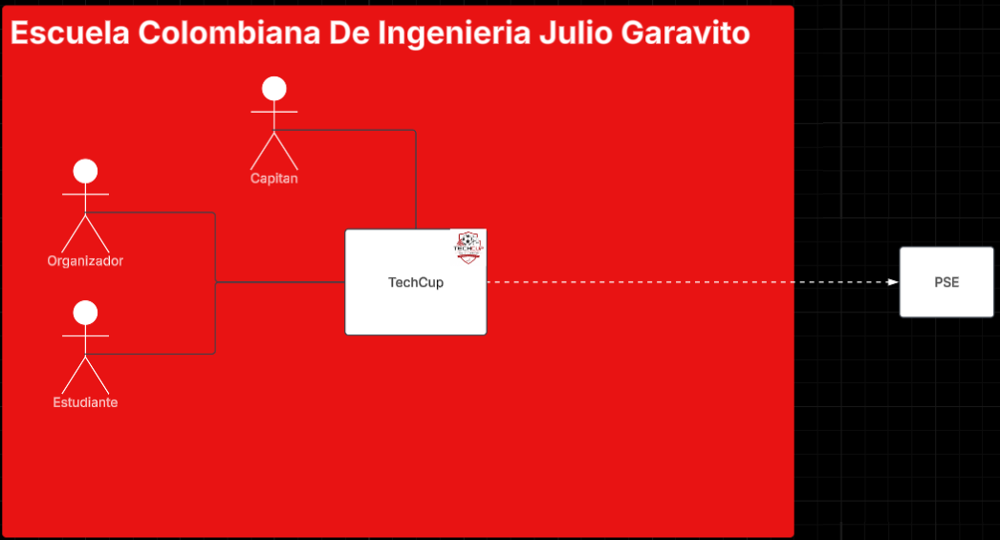

# 📄 Requerimientos del Sistema

## 1. Sistema

* Nombre del sistema: TechCup
* Objetivo: El sistema tiene como objetivo centralizar y facilitar la creación de torneos de fútbol en la escuela a los organizadores, estudiantes y capitanes de equipo.

## 2. Problema a resolver
<h3> Describir el problema principal a resolver del Caso de Estudio </h3>

 La universidad no cuenta con un sistema centralizado que permita crear un torneo, registrar los equipos, procesar y validar los pagos, ver los equipos registrados y generar reportes. 

## 3. Diagrama de Contexto

### 3.1 Diagrama

Link: https://lucid.app/lucidchart/4fbe9775-7274-4e54-9619-9521a5062474/edit?viewport_loc=-165%2C-427%2C3003%2C1081%2C0_0&invitationId=inv_130a7301-665c-40bb-b07a-2a0411b21c73

### 3.2 Actores

En el siguiente cuadro, mapee los actores o roles identificados del sistema

| Actor / Rol            |                               Descripción                               |
|------------------------|:-----------------------------------------------------------------------:|
| Organizador del Torneo |                  Persona que crea el evento en TechCup                  |
| Estudiante             |                  Persona que participa en algún torneo                  |
| Capitán de Equipo      |              Persona que registra el equipo a algún torneo              |

### 3.3 Sistemas externos

En el siguiente cuadro, mapee los sistemas externos que interactúan con el sistema

| Sistema |                      Descripción                       |
|---------|:------------------------------------------------------:|
| PSE     | Método de pago externo controlado por un banco externo |

## 4. Alcance del sistema

### 4.1 Dentro del sistema

Funciones que el sistema sí realiza (Relacione al menos 4).

* Gestionar torneo: crear, cambiar estado y actualizar información (no se puede eliminar).
* Gestionar equipos: crear, actualizar información, realizar pagos de inscripción e inscribirlos en un torneo.
* Registrar usuarios -> estudiantes y organizadores (el cápitan sería el único estudiante con permiso al registro de equipos)*.
* Procesar pagos.
* Validar pagos.
* Consultar pago realizado por un equipo.
* Consultar equipos inscritos en cada torneo.
* Generar informes sobre las inscripciones para cada torneo.
* Generar informe de ingresos por inscripción.

### 4.2 Fuera del sistema

* Gestionar pagos por PSE.
* Gestionar infraestructura y servicios de la base datos.
* Hostiar la página web.

